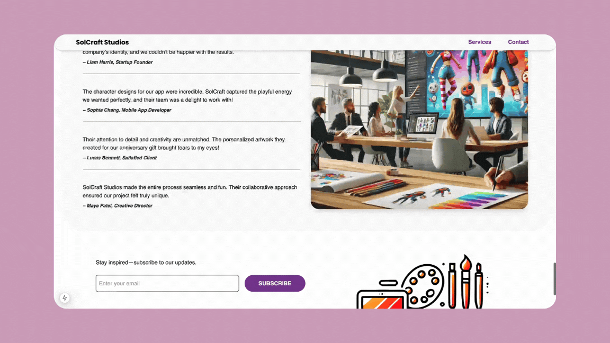

# SolCraft Studios Landing Page ✨

A portfolio project to explore web animations with Motion (formerly Framer Motion) while building a creative landing page.

---

## 🎯 **Project Purpose**

This project was an experiment to learn and practice animation techniques using Motion. I challenged myself to build a landing page for a fictional digital art studio, **SolCraft Studios**, while exploring scroll-triggered animations, tween animations, and interactive elements.

The main goal was to enhance my skills in creating engaging, dynamic user experiences and showcase these abilities in my portfolio.

---

## 💻 **Tech Stack**

- **Frameworks:** Next.js, React
- **Languages:** TypeScript
- **Styling:** Tailwind CSS, Headless UI
- **Animations:** Motion (Framer Motion)

---

## 📖 **The Process**

### 1. **Setting the Scene**

I began by asking an AI to act as a client, which generated a brief for a fictional company, SolCraft Studios. This approach helped me simulate a real-world scenario, giving structure and purpose to the project while keeping the focus on animations.

### 2. **Learning Animations**

- **Documentation First:** I relied on the **Motion documentation** as my primary resource, complemented by AI-generated exercises to create an interactive learning experience.
- **Experimentation:** I focused on:
  - **Scroll-Triggered Animations**: Triggering elements to animate as users scroll through the page.
  - **Tween Animations:** Smooth transitions using easing functions like `ease-in-out`.

### 3. **Breaking Down Real-World Examples**

I analyzed animations from existing websites, breaking them into smaller steps to understand their structure and recreate them in my project. This method helped improve my attention to detail and develop a practical approach to implementing complex animations.

### 4. **Step-by-Step Development**

#### **Top-to-Bottom Build**

I built the page sequentially, starting with the navbar and progressing to the footer.

#### **Desktop-First Approach**

Considering the target audience for SolCraft Studios (desktop users like illustrators or digital creators), I prioritized desktop responsiveness before addressing other viewports.

#### **Hero Component Animations**

- The **title animation** uses `opacity` and `clipPath` to create a smooth reveal effect.
- The **hero video** grows dynamically as the user scrolls and then returns to its original size.
- The **background color** transitions to match the background of the next section, creating a seamless visual flow.

> 

#### **Gallery and Services Sections Animations**

- **Cards**: Subtle hover animations enhance the interactivity.
- **Images**: Smooth entrance animations as the user scrolls into view.

> 

#### **Footer Animations**

- While the user scrolls, the entire page background lightens gradually, creating a cohesive transition to the footer.
- The **last section shrinks** as the footer comes into view, creating a dynamic end to the scrolling experience.

> 

---

## 💡 **What I Learned**

### **Technical Skills**

- Improved understanding of animation fundamentals such as easing, keyframes, and transitions.
- Gained confidence in using Motion to create smooth, responsive interactions.
- Learned to analyze animations and translate them into actionable steps.

### **Realizations for Future Projects**

Through this project, I identified key areas to focus on in my next projects:

- **Hydration Errors:** Understanding and resolving them in Next.js projects.
- **Optimization:** Incorporating performance considerations from the beginning.
- **React Suspense:** Exploring this feature to handle asynchronous rendering efficiently.

---

## 🔧 **Challenges I Faced**

- Starting from scratch with Motion required revisiting animation basics and exploring the library’s capabilities.
- Breaking down and replicating animations from real-world examples was challenging but rewarding, improving my problem-solving skills.

---

## 🌟 **How This Project Prepares Me for a Role**

- **Real-World Simulation:** By following a client-like brief, I demonstrated adaptability to creative constraints and practical problem-solving.
- **Proven Learning Ability:** This project shows my ability to learn new tools, experiment, and deliver results that align with real-world needs.
- **Portfolio Showcase:** It highlights my technical skills in creating dynamic, visually engaging user experiences.

---

## 🌱 **Next Steps for Me**

While this project is complete, I plan to focus on the following in future projects:

- Understanding hydration errors and improving server-side rendering workflows.
- Starting performance optimization early in the development process.
- Exploring advanced React features like Suspense to handle asynchronous tasks.

---

## 🤝 **Acknowledgments**

- Inspiration for animations and transitions was taken from the [Humaan website](https://www.humaan.com/).
- The footer design was influenced by an article on [Webflow Blog](https://webflow.com/blog/website-footer-design-examples?utm_source=google&utm_medium=search&utm_campaign=SS-GoogleSearch-Nonbrand-DynamicSearchAds-Tier2&utm_term=aud-520005535089:dsa-1729073405028___617245336990__&gad_source=1&gclid=CjwKCAiAjeW6BhBAEiwAdKltMnHNAQZYVJdNAhlII38MCmp-oYFeaFG9kxv2VNC6RgVHzJejJR59XBoC07EQAvD_BwE).
